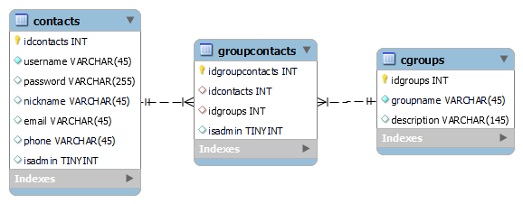

# ContactGroupAPI

a Simple application API for FrontEnd to use. Just testing technologies like Entityframework Database first approuch. Joining and delivering data from controller. JWT is aim. 

## ER model

## Database connection

For development (local machine) I created environment variable called "DATABASE_URL" in Program.cs. And in Database.cs I use that variable. So in production environment (example Heroku), I set enviroment variable which is configured for the Heroku MySQL.

## JOIN Queries
I used technique to join data in controller end and just simple queries to database. Works well in small and medium data masses. Would not do this in large scale user environment. Then I would use sql to reduse the data amount moving between DB and BackEnd and eventually to FrontEnd.
